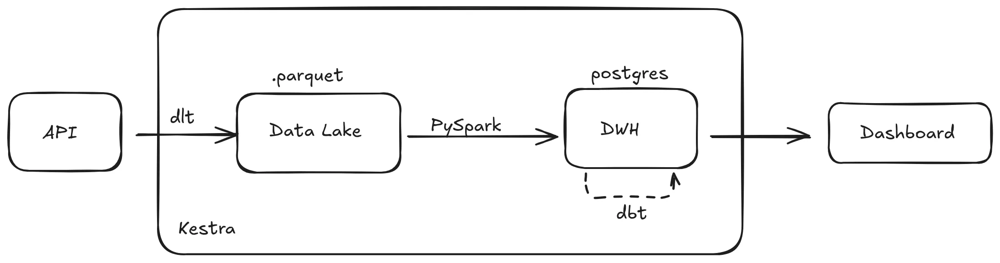
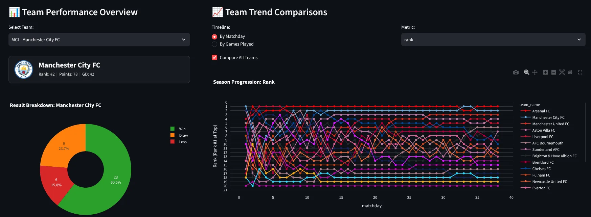
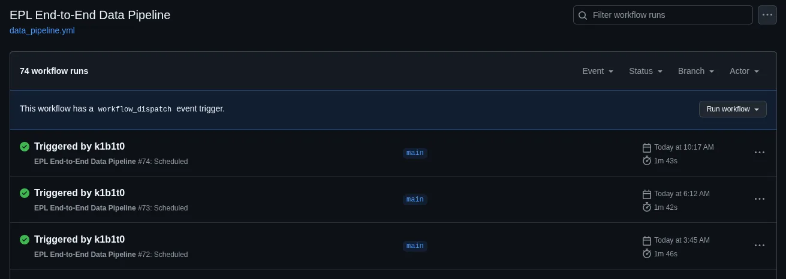

# EPL Dashboard

## Problem
Khoá học [DE Zoomcamp](https://github.com/DataTalksClub/data-engineering-zoomcamp) yêu cầu một data pipeline hoàn chỉnh và một dashboard gồm 1 graph dữ liệu phân loại 1 graph dữ liệu theo thời gian.
Ý tưởng của tôi là loại [graph](https://www.instagram.com/reel/DSc1AOtjQaS/?utm_source=ig_web_copy_link&stkn=NTc4MTIwNjQ2YQ==) này. Đơn giản là thấy nó thú vị, thấy trực quan hành trình của các đội mà lại chỉ có trong các post của đài nên làm thử.
Mục tiêu:
- Cào và làm sạch, lưu trữ dữ liệu các trận đấu EPL
- Xuất ra dashboard có graph như mong muốn

## Method
Kiến trúc ELT (hơi over engineered nhưng để học mà)

**Extract**: Sử dụng API của [football-data.org](https://www.football-data.org/) vì nó free và có đủ dữ liệu cần thiết (season, match, score...) Sử dụng dlt để cào dữ liệu theo schema và lưu lại thành các file .parquet. Lưu local bởi vì file .parquet nhẹ, truy vấn nhanh và cần dữ liệu quá khứ để sửa lỗi nếu cần (giả sử lần cào mới bị lỗi dữ liệu)

**Load**: Sử dụng Pyspark để đọc file .parquet, deduplicate (file mới nhất theo `last_updated` và `_dlt_load_id`) và nạp vào DWH thành các bảng `raw`. PySpark cũng sẽ kiểm tra các mùa đã hoàn thành để chốt lại, sau không mất công cào lại nữa.

**Transform**: Sử dụng Postgres cho DWH vì dùng quen và chạy local, dữ liệu cũng ít (380 trận x 4 mùa) nên không gặp vấn đề khi truy vấn. Chủ yếu là dbt để data modeling, xây dựng các model staging, intermediate, marts để làm sạch dữ liệu, xử lý logic để chuẩn bị cho BI và kiểm thử dữ liệu. Kết quả cuối cùng là các bảng marts sẵn sàng để truy vấn.

Orchestration: Sử dụng Kestra trong local để điều phối, đơn giản là gọi 3 luồng ELT và lập lịch. Nhưng khi host thì sử dụng GitHub Action.

Dashboard (Phụ): Sử dụng streamlit. Truy vấn trực tiếp từ các bảng marts.

## Challenges
**Các trận đấu bị hoãn, hoặc đá bù**. Làm sao để thể hiện sát nhất phong độ thực tế của đội bóng? Hướng giải quyết là quy ước thể hiện chỉ số theo đúng từng matchday, ngoài ra còn sắp xếp khác là phân bố theo chuỗi trận thực tế. Cái này sẽ sát với phong độ thực tế hơn dù cũng không chính xác lắm, tương lai có thể nghĩ đến hiển thị trên trục thời gian.

Pipeline chạy định kỳ thì làm sao để phân biệt giữa **dữ liệu của các mùa giải đã kết thúc và mùa giải hiện tại** (cần định kỳ). Cách giải quyết là chốt mùa giải kết thúc bằng file `matches_full`, một khi đã có file này thì các lần chạy sau không xử lý lại mùa giải nữa, còn mùa giải hiện tại thì vẫn cứ chạy.

**Thiết kế data model** không phù hợp. Chỉ phát hiện ra sau khi làm (sau khi đã cào data từ API và qua các bước lưu trữ). Sau này chốt lại thiết kế cuối về cơ bản là như bảng standings, nhưng thêm cột `matchday` (cho matchday) và lưu trữ nhiều bản với `played` khác nhau.

Khác biệt giữa môi trường local và prod. Phải dùng thêm `psycopg2` để xoá dữ liệu, vì `PySpark JDBC` chỉ hỗ trợ ghi append hoặc overwrite cả table.

## Results
Pipeline chạy ổn 3 tiếng một lần.

Kiến trúc dbt layers chuẩn (staging -> intermediate -> marts) và có test cơ bản để phát hiện lỗi ngay khi dữ liệu có vấn đề.

Schema dù thiết kế chả theo chuẩn cũng chả theo mô hình sao lắm nhưng vẫn có khả năng mở rộng (ví dụ mới thêm bảng xếp hạng hiện tại / matchday).

## Takeaways
Cách model data rất quan trọng. Mặc dù khi cào API của football-data thấy response rất dài, thậm chí nhiều trường còn không update, nhưng cách thiết kế model của người ta map được cho các vấn đề players, teams, seasons... và cũng map được các giải đấu khác kể cả league hay cup.

Mất quá nhiều thời gian để xử lý ref, team, squad nhưng không sử dụng tới. 

Logic deduplicate hiện tại vẫn chỉ là mới nhất, không có cơ chế xử lý trong trường hợp "dữ liệu mới nhất lại bị lỗi" cần rollback chẳng hạn.

Mặc dù thường khi khởi chạy, máy ảo GitHub Actions sẽ xây mới nên không có dữ liệu lịch sử (ví dụ lần cào mùa 2026 3 tiếng trước). Pipeline sẽ commit các file `matches_full` lên repo để không mất dữ liệu mùa cũ.

[GitHub](https://github.com/k1b1t0/epl-dashboard)

[Demo](https://epl-stat.streamlit.app/)