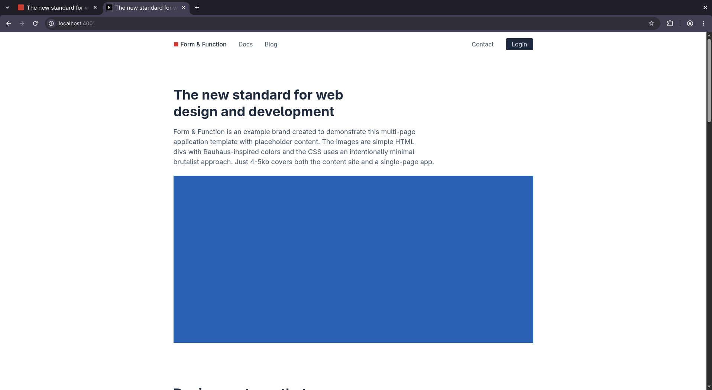
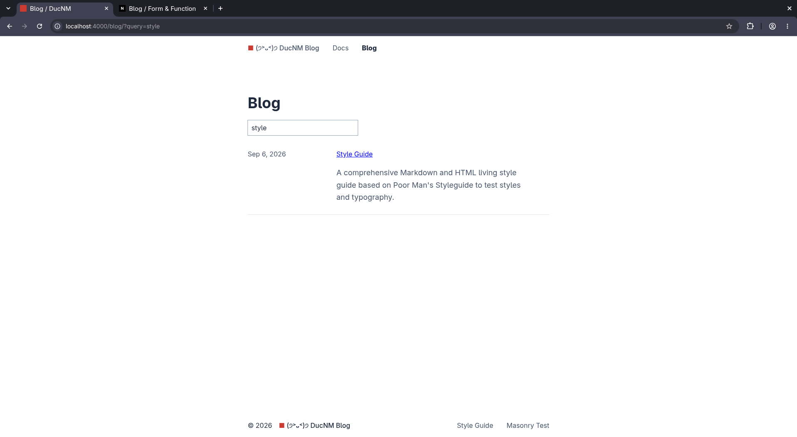
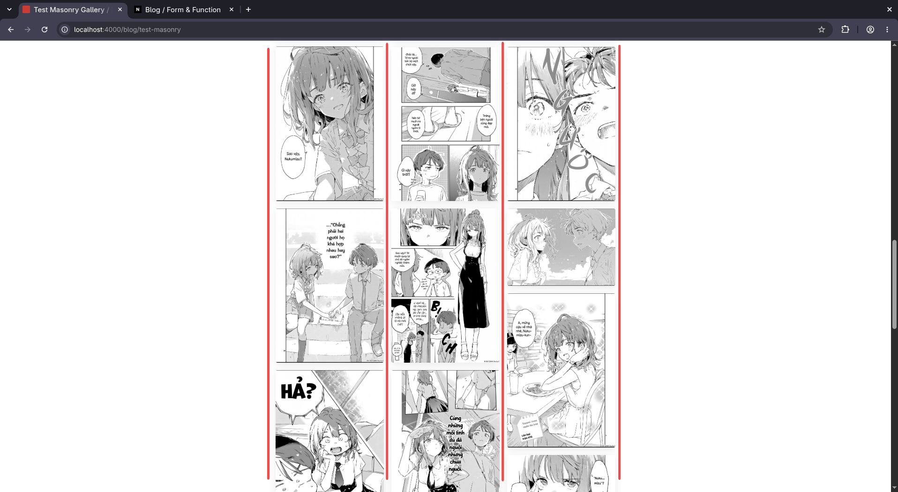
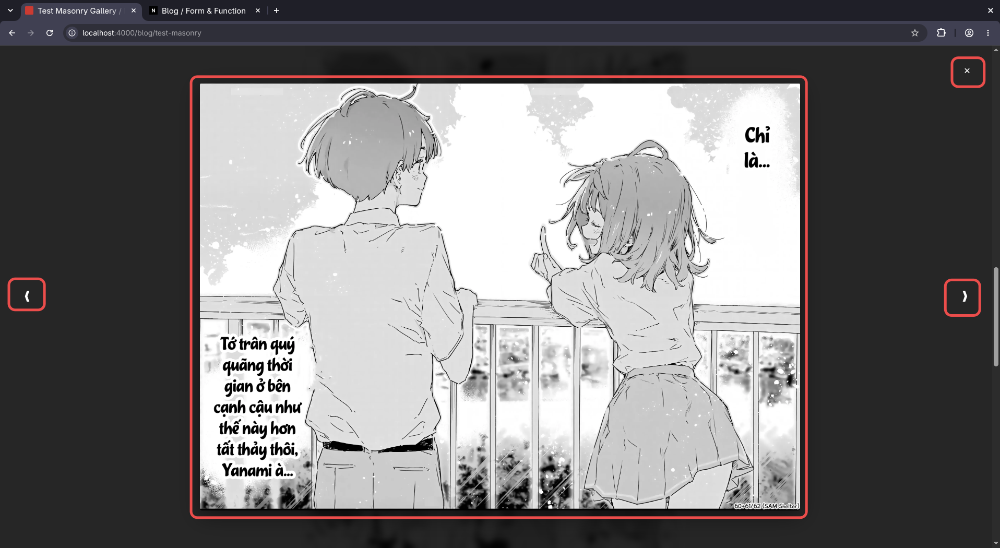

# Tự tạo Blog cá nhân với NueJS

Yes, tôi biết mình lại làm lại cái blog của mình lần thứ 2 trong năm nay. Nhưng mà kệ.

## Tại sao cần blog cá nhân
Để mình thích đăng gì thì mình đăng, không sợ sự soi mói như trên mạng xã hội. Trên Internet giờ đầy bot, AI, ragebait, có lẽ ở những trang web cá nhân này là nơi hiếm hoi tồn tại tính "người" thực sự (hoặc là không).

## Tại sao tôi làm lại blog
Dù đã mất vài ngày để thiết kế cái blog cũ, nhưng giờ tôi lại thấy nó khá "xấu". Hơn nữa, tôi sử dụng 11ty vì thấy nó khá đơn giản ban đầu để xử lý markdown và collection. Nhưng rồi càng lúc tôi nghịch cái file config nó càng "bùng nổ" ra, 11ty sắp chuyển thành web-awesome và tôi cảm thấy mình khá lười khi đọc mấy cái docs của 11ty.

```
Permissions Size User   Date Modified Name
drwxr-xr-x     - kibito  5 Sep 19:36   _config
drwxr-xr-x     - kibito  5 Sep 19:36   _data
drwxr-xr-x     - kibito  5 Sep 19:36   _includes
drwxr-xr-x     - kibito  5 Sep 19:36   content
drwxr-xr-x     - kibito  5 Sep 19:36   css
drwxr-xr-x     - kibito  5 Sep 19:36   public
.rwxr-xr-x   901 kibito  5 Sep 19:36   create_post.sh
.rw-r--r--  5.4k kibito  5 Sep 19:36   dark-mode.md
.rw-r--r--  5.3k kibito  5 Sep 19:36   eleventy.config.js
.rwxr-xr-x   52k kibito  5 Sep 19:36   icon.jpg
.rw-r--r--  1.1k kibito  5 Sep 19:36   LICENSE
.rw-r--r--    54 kibito  5 Sep 19:36   netlify.toml
.rw-r--r--   80k kibito  5 Sep 19:36   package-lock.json
.rw-r--r--  1.7k kibito  5 Sep 19:36   package.json
.rw-r--r--    86 kibito  5 Sep 19:36  󰂺 README.md
.rw-r--r--    26 kibito  5 Sep 19:36   vercel.json
```

## Chuẩn bị

### Nguồn cảm hứng

Đúng vậy, hãy hình dung và tưởng tượng ra một trang web của cá nhân mình sẽ phải "bùng lổ" như nào.

Bạn có một không gian mà bạn **thực sự được sáng tạo** theo ý mình. Bạn thích gái alime, bạn cho vào, bạn thích game, bạn cho vào, bạn thích màu hồng nam tính, bạn cho vào nốt.

Bạn có thể tham khảo vài trang blog của những người khác, cá nhân tôi đã từng rất ấn tượng với nhiều bài, hoặc mới đầu thì copy cũng được. Cá nhân tôi thì có vài nguồn cảm hứng nhất định (tôi cũng quên kha khá rồi):
- [Ham Vocke](https://hamvocke.com/)
- [zacoons' place](https://zacoons.com/)
- [Herman's blog](https://herman.bearblog.dev/)

Nhìn chung thì có thể thấy gu của tôi khá là đơn giản, vậy nên tôi cũng áp cái CSS mặc định của template Nue luôn.

### SSR, CSR, hay SSG
Web hiển thị trên trình duyệt của bạn là html đập với css để nhìn đẹp hơn và js để chạy code cho các tương tác (bấm nút ra quà). Chính nhờ khả năng chạy code js ngay trên web, người ta tạo ra CSR, chỉ gửi code js rồi nó chạy trên trình duyệt của bạn và tự sinh nội dung html, vì code chạy trên máy bạn (client) nên gọi là Client Side Rendering.

Nhưng CSR gặp vấn đề với lần load đầu tiên lâu (vì phải chạy code sinh nội dung), dẫn đến vấn đề trải nghiệm và bot SEO không đọc được nội dung web. Thế là có Server Side Rendering là CSR nhưng mớm trang nội dung đầu tiên.

Static Site Generation thì đơn giản hơn, nội dung html được sinh đầy đủ từ Build time và server chỉ việc gửi nó cho người dùng thôi. Ưu điểm là không phải đợi chạy code sinh nữa, nhược điểm là nội dung "tĩnh", muốn sửa thì phải build lại nội dung từ server, hay không thể linh động cá nhân hoá. Vì vậy SSG rất phù hợp với documentations hay web blogs.

Và như đã nói ở trên, muốn làm blog, thì chọn **SSG**.

### Tại sao lại là Nue?
Nue đơn giản, và "new". Có thể nó sẽ chết yểu, nhưng một điểm mạnh là mới nên doc của nó không quá dài nên tôi có thể đọc (lol) và tôi cũng clone lại repo rồi.

Tôi cũng muốn cấu trúc project đơn giản (chỉ cần html css js là đủ). Nue đáp ứng đúng điều đó, cái structure dev và build giống y nhau (chắc chỉ thay .md bằng html), giúp cho việc config các đường link ảnh bớt rắc rối đi nhiều.

Nue có `nuemark` để render `markdown` ở mức cơ bản (không có checkbox, không có math) để viết blog, nó có quản lý collections cho các blog và syntax để chèn html vào .md cũng khá đơn giản.

*Tôi cần đính chính là tôi không phải là chuyên gia về Nue, tôi chỉ chia sẻ lại những gì mình biết, nghĩa là những gì hoạt động với tôi và cho cái blog này. Có thể tôi làm sai triết lý của Nue, có thể tôi không biết nhiều thứ, nếu vậy thì rất mong nhận được thêm gạch đá để xây nhà*

### Host như nào?
Có nhiều nền tảng cho phép host web tĩnh, tôi biết GitHub Pages, Cloudflare Page, Surge.sh có free tier khá tốt. Về cơ bản chỉ các nền tảng chỉ cần chạy engine (`nue`) để render ra các file html và host chúng.

## Triển khai

### Tạo template full
Đầu tiên sử dụng lệnh `nue create` để tạo template. Thực ra cái `nue create blog` cũng là khá đủ cho một cái blog cơ bản rồi, nhưng tôi thấy cái `full` nó hay hơn thì dùng.

```bash
nue create full
cd full
nue
```



Tôi thường dùng 3 lệnh đơn giản
- `nue create` - tạo template
- `nue` ~ `nue serve` - chạy local host với hot reload
- `nue build` - build ra artifact tại `.dist` (sản phẩm cuối cùng, chuẩn html css js)

Project này có cả backend, nhưng vì không cần nên tôi sẽ xoá đi
- Xoá `admin/` `contact/` `login/` `@shared/lib` `@shared/server` `Makefile`
- Xoá cấu hình `site.yaml`
```yml
# custom imports
import_map:
  crud: /@shared/lib/crud.js
  admin: /admin/admin.js
```
- Xoá `header.html`
```yml
<nav>
  <a href="/contact/">Contact</a>
  <a class="button" href="/login/">Login</a>
</nav>
```

### Cấu trúc của project
Đường dẫn của web sẽ được map y hệt cấu trúc project
```
index.html          → /
about.html          → /about
blog/index.html     → /blog/
blog/first-post.md  → /blog/first-post/
```

Trong `@shared` là các thành phần chung của cả project. `design/` chứa css cho các thẻ, `ui/` chứa các component cơ bản cho các trang
```
@shared/design/
├── base.css         # Typography, colors, spacing
├── button.css       # All button variants
├── content.css      # Blog posts, documentation
├── dialog.css       # Modals, popovers
├── document.css     # Page structure
├── form.css         # All form elements
├── layout.css       # Grid, stack, columns
├── syntax.css       # Code highlighting
├── table.css        # Data tables
└── apps.css         # SPA-specific components
```

Config của site nằm trong `site.yaml`, phần đầu (meta, site, rss) là các thông tin cơ bản bạn có thể tự chỉnh sửa, ở đây tôi muốn tập trung vào cái collections.

Thử chạy lệnh `nue build`, kết quả trong folder `.dist` cũng sẽ tương đồng với project gốc, nhưng các file .md sẽ được render thành .html và file js được bundle. Project sẽ giống như một web html css js cơ bản.

Sau đây tôi sẽ trình bày cụ thể hơn về các tính năng mà tôi đã implement (ở mức đơn giản) để hoàn thiện một trang blog.

### Danh sách blogs
Thực ra cái này có sẵn rồi, tôi chỉ muốn nói thêm về cách nó hoạt động. Trong `/blog` gồm có `components.html` chứa các component và các file .md nội dung.

Trong `site.yaml` đã có định nghĩa cho collections của blog
```yaml
collections:
  blog:
    include: [ blog/ ]
    skip: [ skip ]
    sort: date desc
```

`components.html` định nghĩa một html component để liệt kê các post thành các dòng trên bảng
```html
<table :is="blog-entries">
  <tr :each="page in blog">
    <td><pretty-date :date="page.date"/></td>
    <td>
      <a href="{ page.url }">{ page.title }</a>
      <p>{{ markdown(page.description) }}</p>
    </td>
  </tr>
</table>
```

`blog/index.md` gọi cái component bằng `[blog-entries]` chính là trang danh sách các blog. Các blog sử dụng [markdown](https://nuejs.org/docs/nuemark) cơ bản và [front matter](https://nuejs.org/docs/template-data) cho metadata.

Thực ra thế cùng là đã khá hoàn thiện một blog đủ để viết, có danh sách post và các post được render markdown chuẩn chỉnh.

### Tìm kiếm
Ý tưởng của tôi là: đã có sẵn danh sách blog rồi, chỉ cần lọc ra các post có chứa keyword là được.



Để thêm search box, tôi thêm vào một component như ở dưới. Sau đó viết một script js để đọc keyword đó, cập nhật URL và danh sách post (một cái `table`). Dựa theo [doc](https://nuejs.org/docs/page-dependencies), hoá ra tôi chỉ việc thêm file .js vào đúng folder `blog/` và nó sẽ tự thêm vào html trong artifact.

Component search box, gọi bằng `[blog-search]`
```html
components.html

<!-- Search blog -->
<div :is="blog-search" class="search-box">
  <input type="search" id="blog-search-input" placeholder="Search posts by title, tag, date..." autofocus>
</div>
```

```js
search.js

function initBlogSearch() {
  const input = document.querySelector('#blog-search-input')
  if (!input) return

  function filterPost(query) {
    const q = (query || '').toLowerCase().trim()
    const url = new URL(window.location)

    // Set param tren URL 
    if (q) url.searchParams.set('query', q)
    else url.searchParams.delete('query')
    window.history.replaceState({}, '', url)

	// An cac file khong lien quan
    const rows = document.querySelectorAll('table tr')
    rows.forEach(row => {
      const match = !q || row.textContent.toLowerCase().includes(q)
      row.style.display = match ? '' : 'none'
    })
  }

  input.oninput = (e) => filterPost(e.target.value)

  // Neu da co san query
  const initialQuery = new URLSearchParams(window.location.search).get('query')
  if (initialQuery) {
    input.value = initialQuery
    filterPost(initialQuery)
  }
}

document.addEventListener('DOMContentLoaded', initBlogSearch)
window.addEventListener('route', initBlogSearch)
```

Cấu trúc của `blog/` sẽ có dạng
```
blog/
	components.html
	search.js
	lightbox.js
	...<cac file md>
```

### Masonry Gallery
Tôi rất thích chụp ảnh, vậy nên từ khi tạo blog tôi đã muốn có những các trang gallery để trưng bày ảnh, tôi thấy layout Masonry nhìn rất hay. 

Có nhiều tutorial hướng dẫn sử dụng `grid` nhưng tôi thấy đa phần là phải căn tay, tôi tìm được thuộc tính CSS `column-count` giúp chia nội dung ra theo cột. Mặc dù nó không tự do bằng các layout trên mạng, nhưng với tôi thấy nó cũng đã khá "nghệ" rồi.



Để thực hiện layout này, tôi tạo riêng 1 component cho gallery. Về cơ bản là nó sẽ ném liên tục các ảnh vào trong cái section `gallery` này.
```html
<!-- Masonry Gallery -->
<section :is="gallery" class="masonry" :if="folder && photos">
  <figure :each="file in photos.split(',')">
    
  </figure>
</section>
```

Và tôi tạo file css `@shared/design/masonry.css` cho riêng cái gallery để dễ nhìn
```css
/* Gallery */
@layer component {
  .masonry {
    column-count: 3;
    column-gap: 1rem;
    column-fill: balance;
    width: 100%;
    margin-block: 2rem;

    figure {
      break-inside: avoid;
      margin: 0 0 1rem 0;
      background: transparent;

      img {
        width: 100%;
        height: auto;
        display: block;
        border-radius: 4px;
        box-shadow: 0 4px 16px rgba(0, 0, 0, 0.08);
        transition: transform 0.25s ease;

        &:hover {
          transform: scale(1.02);
        }
      }
    }
  }

  @media (max-width: 700px) {
    .masonry {
      column-count: 2;
    }
  }
}
```

Một vấn đề hơi bất tiện trong thiết kế hiện tại là tôi phải liệt kê cả folder và photos vì cần cả 2 để ghép lại thành src lúc sau, hiện tại tôi chưa biết làm sao để nó tự động đọc tất cả các file trong folder, đây có thể là 1 TODO cho tương lai. 

(hiện tại để làm nhanh thì tôi có viết một script bash để tự đọc folder và sinh ra dòng như dưới rồi tôi copy vào)
```
[gallery folder="test-masonry" photos="1016e75c-3f3a-489f-8f78-2a4803ce4744.webp, 23639f75-a06c-439c-8a9d-cef716596ddb.webp, 290d6623-d75b-4f4c-bcc7-a1c16081d7f3.webp, 29d16cc7-e0f0-42ee-a995-afdcd084847b.webp, 3358ea6e-9ba5-4468-8cc6-f078c1528536.webp]
```

### Image Viewer
Và tính năng cuối cùng, vì ảnh được chia theo dạng gallery nhìn khá nhỏ, cần có tính năng image lightbox như [Glightbox](https://biati-digital.github.io/glightbox/). 



Một lightbox theo ý tôi sẽ gồm có các thành phần và chức năng như
- 2 nút mũi tên 2 bên để di chuyển ảnh (hoặc sử dụng phím mũi tên)
- dấu x để đóng modal (hoặc phím esc)
- ảnh được zoom lên (tất nhiên rồi)

Để lightbox sử dụng được cho mọi image trong blog (kể cả ngoài gallery), tôi đã tham khảo [doc](https://nuejs.org/docs/layout-system) và thấy toàn bộ nội dung đều được gói trong `<article>`, vì vậy css selector `article img` sẽ giúp tôi lựa chọn hết được các ảnh cần thiết. (Đề phòng tương lai có để banner quảng cáo thì cũng không chọn nhầm nhỉ)

Tôi tạo component `<dialog>` và đặt nó trong `<pagefoot>` để nó không bị chèn vào article và load trong mọi page. (`pagefoot` là tag của nue)

```html
<pagefoot>
  ...
  
  <!-- Image Viewer Modal -->
  <dialog id="lightbox-dialog" class="lightbox-modal">
    <button class="lightbox-close" aria-label="Close">✕</button>
    <button class="lightbox-prev" aria-label="Previous">❮</button>
    
    <button class="lightbox-next" aria-label="Next">❯</button>
  </dialog>
</pagefoot>
```

Tương tự như trên, tôi tạo file `lightbox.js` và cũng để trong folder `blog/` (vì hiện tại image chỉ có trong các bài blog)
```js
function initLightbox() {
  const dialog = document.querySelector('#lightbox-dialog')
  const lightboxImg = document.querySelector('#lightbox-img')
  // Loai tru chinh cai anh trong modal
  const triggers = Array.from(document.querySelectorAll('article img:not(#lightbox-img)'))

  if (!dialog || !lightboxImg || !triggers.length) return

  let currentIndex = 0

  function showImage(index) {
    if (index < 0) index = triggers.length - 1
    if (index >= triggers.length) index = 0
    currentIndex = index
    lightboxImg.src = triggers[currentIndex].src
  }

  // Click event cho tung anh
  triggers.forEach((img, index) => {
    img.style.cursor = 'zoom-in'
    img.onclick = () => {
      showImage(index)
      dialog.showModal()
    }
  })

  // Nut dieu khien trong modal
  const prevBtn = dialog.querySelector('.lightbox-prev')
  const nextBtn = dialog.querySelector('.lightbox-next')
  const closeBtn = dialog.querySelector('.lightbox-close')

  // An nut dieu khien neu chi co 1 anh
  if (prevBtn) prevBtn.style.display = triggers.length > 1 ? '' : 'none'
  if (nextBtn) nextBtn.style.display = triggers.length > 1 ? '' : 'none'

  if (prevBtn) prevBtn.onclick = (e) => { e.stopPropagation(); showImage(currentIndex - 1) }
  if (nextBtn) nextBtn.onclick = (e) => { e.stopPropagation(); showImage(currentIndex + 1) }
  if (closeBtn) closeBtn.onclick = () => dialog.close()

  dialog.onclick = (e) => {
    if (e.target === dialog) dialog.close()
  }

  // Bat phim dieu huong (mui ten, esc)
  window.onkeydown = (e) => {
    if (!dialog.open) return
    if (e.key === 'ArrowLeft') showImage(currentIndex - 1)
    if (e.key === 'ArrowRight') showImage(currentIndex + 1)
    if (e.key === 'Escape') dialog.close()
  }
}

document.addEventListener('DOMContentLoaded', initLightbox)
window.addEventListener('route', initLightbox)
```

### Host
SSG khá nhẹ nên khá dễ để host free, bạn có thể host bằng GitHub Pages, nhưng tôi sử dụng [Cloudflare Page](https://www.Cloudflare.com/products/pages/) vì cái tên miền free nghe khá chất `.pages.dev`.

Thêm lệnh build vào `package.json`
```json
"scripts": {
    "build": "nue build"
  }
```

Đối với Cloudflare Page, chỉ cần push project lên github rồi kết nối tới Cloudflare. Build command là `bun run build` còn Build output directory là `.dist`

## Kết
Vậy là cũng đã hoàn thành một trang blog có các tính năng khá thú vị như tìm kiếm và image gallery. Các tính năng đều được thực hiện bằng html css js, nue chỉ hỗ trợ trong việc chèn vào các trang khi render SSG, nên bạn có thể thoải mái mở rộng với các chức năng khác thú vị (dark theme, music player, nút donate tiền hehe).