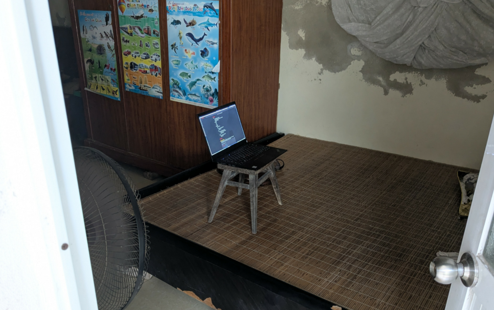

---
title: "Hành trình tư duy với Dark mode"
date: "2026-06-08T14:25:44+07:00"
tags:
    - dev-log
--- 
Cuối tuần tôi về quê, với cái setup đẳng cấp này, tôi nghĩ mình nên thử làm một cái gì đó hay hay, và thế là tôi quyết định thử làm chức năng nút đổi theme cho trang web này. Tưởng đơn giản nhưng rồi nó lại tốn của tôi cả một chiều (và tối).


## Light / Dark theme
Để tạo light / dark theme đơn giản là tạo các css variables và sử dụng nó cho mọi thẻ html. Cũng khá may là project này đã được set up từ đầu rồi, nên CSS sẽ trông như sau.

```css
/* Default light theme */
:root,
html[data-theme="light"] {
	color-scheme: light;
	--background-color: #faf8f3;
	--text-color: #2c1a0e;
	...
}

/* System dark, not light mode */
@media (prefers-color-scheme: dark) {
	:root:not([data-theme="light"]) {
		color-scheme: dark;
		--text-color: #D8CFAE;
		--background-color: #231C18;
		...
	}
}

/* Dark mode */
html[data-theme="dark"] {
	color-scheme: dark;
	--text-color: #D8CFAE;
	--background-color: #231C18;
}
```

Các bộ màu được xác định bởi attribute `data-theme` của thẻ `html`. `(prefers-color-scheme)` giúp xác định theme của hệ thống (OS, trình duyệt). Và cách gọi biến khá đơn giản `var()`.

```css
h1, h2, h3, h4 {
	color: var(--heading-color);
}
```
## Init theme
Một vấn đề là, web sẽ luôn hiển thị màu theo System. Nhưng nếu trước đó người dùng đã lựa chọn sáng / tối thì sao? Họ sẽ phải chọn lại mỗi lần vào lại trang? Điều này rất bất tiện.

Vì vậy tôi đã tìm đọc [bài viết này](https://www.joshwcomeau.com/react/dark-mode/) của Josh Comeau về dark mode. Các giải quyết của ông là lồng 1 `<sciprt>` vào trước thẻ `<body>` hoặc trong thẻ `<head>`, load trước khi HTML render để set tag `data-theme` cho `<html>`. Vậy là tôi bắt tay vào viết luôn.

```html
<script>
	const root = document.documentElement;
	const savedTheme = localStorage.getItem("ducnm-blog-theme") || "system";
	let dataTheme = savedTheme;
	if (savedTheme === "system") {
		dataTheme = window.matchMedia('(prefers-color-scheme: dark)').matches ? "dark" : "light";
	}
	localStorage.setItem("ducnm-blog-theme", savedTheme);
	root.setAttribute("data-theme", dataTheme);
</script>
```

Tôi sử dụng `localStorage` để lưu trữ 1 giá trị riêng là `ducnm-blog-theme` có khoảng giá trị là `dark | light | system`. `localStorage` sẽ lưu trữ đến khi người dùng xoá cookies và cache, nên sẽ không lo mất option trong lần truy cập sau, mà việc truy cập `localStorage` là đồng bộ nên bắt buộc script phải xong trước khi load HTML.

Logic khá đơn giản:
- Check giá trị trong `localStorage`, nếu có thì dùng
- Nếu không thì sử dụng màu theo system, không có nữa thì dùng light
## Toggle button
Toggle button có lẽ sẽ đơn giản hơn, nếu tôi không tự bóp bằng cái tính năng dở hứng lên (đặc biệt là dành 1 tiếng căn chỉnh icon bất thành và lại bỏ đi). Ý tưởng cho toggle button khá đơn giản, trên nav, có 3 trạng thái `dark | light | system`, chỉ cần bấm là nó sẽ nhảy sang theme tiếp theo. Nghe khá đơn giản chứ, cho đến khi các rắc rối dần kéo đến...
### Tạo cái nút
Tôi demo thử bằng 1 cái button ghi "Theme", logic ban đầu đơn giản là bấm nó, nó đổi theme và đổi nội dung tương ứng:

```js
function applyTheme(theme) {
    let dataTheme;
    if (theme === 'light' || theme === 'dark') {
        dataTheme = theme
    } else {
        const isDarkMode = window.matchMedia("(prefers-color-scheme: dark)").matches;
        if (isDarkMode) {
            dataTheme = "dark"
        } else {
            dataTheme = "light"
        }
    }

    localStorage.setItem("ducnm-blog-theme", theme);
    document.documentElement.setAttribute("data-theme", dataTheme);
}

const toggleButton = document.querySelector('.theme-toggle');
if (toggleButton) {
    toggleButton.addEventListener('click', (e) => {
        switchAudio.play();
        let next;
        const current = localStorage.getItem("ducnm-blog-theme") || "system";
        if (current === "dark") {
            next = "light";
        } else if (current === "light") {
            next = "system";
        } else {
            next = "dark";
        }

        applyTheme(next);
        e.currentTarget.textContent = getLabel(next);
    });
}
```
### Init cái nút
Một vấn đề ở trên là, khi mở trang web lần đầu, nút sẽ hiện "Theme" thay vì "Dark | Light | System". Ban đầu tôi đã nghĩ là mặc kệ nó, nhưng nhảy thử 2-3 tab mới nhận ra là nó VÔ CÙNG KHÓ CHỊU. Cứ mỗi lần nhảy tab mới, nó lại nhảy về "Theme" mà không báo theme hiện tại. Người dùng sẽ phải ấn lại nó, và sẽ phải đi hết 1 vòng toggle.

Vấn đề này khiến tôi mất vài tiếng để sửa, một ý tưởng đã từng được nghĩ tới là thêm, một script vào đoạn header (ngay sau khi chọn init color) để init cho cái button, sử dụng một biến `window.__THEME__`, nhưng cái này gặp vấn đề ngay sau đấy vì cái script js ngoài của button được load theo kiểu "module" nên trình duyệt sẽ ưu tiên load HTML trước, nhìn cái nút sẽ flash 1 cái và rất khó chịu.

Sau một hồi thử, tôi quyết định viết 1 script ngắn ngay dưới thẻ `<button>`, sẽ load cùng nó luôn. Cách này thực sự đơn giản hơn tôi nghĩ rất nhiều.

```html
<button theme-index="0" class="theme-toggle">Theme</button>
<script>
	{
		const theme = localStorage.getItem("ducnm-blog-theme") || "system";
		document.querySelector('.theme-toggle').textContent = theme.charAt(0).toUpperCase() + theme.slice(1);
	}
</script>
```
### Flash màn hình
Bạn đọc lại cái này và tự hỏi wtf? Tôi đã dành cả một phần để init theme tránh flash rồi mà sao đến đây lại ăn flash. Câu trả lời là vì 3 dòng code dưới đây:

```css
*, *::before, *::after {
  transition: background-color 0.3s ease, color 0.2s ease, border-color 0.2s ease;
}
```

Đoạn code này giúp việc chuyển giữa các theme nhìn mượt mà hơn. Nhưng nó cũng là nguyên nhân gây ra flash khó hiểu mỗi khi tôi load trang (ngl tôi đã mất tầm tiếng để phát hiện ra).

Chuyện là web sẽ được khởi tạo với màu như system, rồi nó theo script và chuyển sang màu init (như trên). Nếu màu init mà khác màu system, trình duyệt sẽ nhận diện đó là "transition" và sẽ áp hiệu ứng vào ngay đầu, gây ra quả flash khiến tôi mù mắt bấy lâu.

Để fix cái này, tôi viết tạm 1 script ngay sau init, để vô hiệu cái hiệu ứng này và chỉ kích hoạt khi nào bấm nút toggle.

```html
<style id="no-transition" eleventy:ignore>
	*, *::before, *::after {
		transition: none !important;
		animation: none !important;
	}
</style>	
```

```js
// Re-enable transitions
const noTransitionStyle = document.getElementById('no-transition');
if (noTransitionStyle) {
    requestAnimationFrame(() => {
        noTransitionStyle.remove();
    });
}
```
### Sound effect
Tưởng chừng mọi thứ đã xong xuôi, cũng là lúc tôi nảy lên ý tưởng: một âm thanh ASMR khi bấm nút thì sao? Chắc không phức tạp thế đâu, chỉ cần tải audio, thêm audio và `play()` khi bấm nút là được nhỉ?

```js
const switchAudio = new Audio('{{ "/sounds/switch.wav" | url }}');
...
if (toggleButton) {
    toggleButton.addEventListener('click', (e) => {
        switchAudio.play();
        ...
    });
}
```

Yeah, nhưng vấn đề ở đây nằm ở cơ chế render của 11ty cũng như build page trên Github Page. Hiểu đơn giản là sau khi build, thì cái artifact (`_site`) sẽ có cấu trúc khác cấu trúc khi code rất nhiều, và khi mang lên Github Page thì nó sẽ thêm cái directory gốc là tên repo nữa.

Vì vậy rất nhiều "thử và sai" đã xảy ra. Tôi thử đủ cách, code cứng url, load url ngay trong init, tạo global variable cho audio. Cuối cùng đi tới cách ở trên, kết hợp njk để load url cho file js.

Trong lúc fix thì nó cũng lòi ra nhiều cái lỗi từ trước, cụ thể là các code preload font của tôi cũng đỏ lòm do đổi url. Vậy là lại fix thêm nhiều thứ khác, đến giờ thì chạy "tạm ổn" rồi.
## Tổng kết
Bài học rút ra là:
- Đọc doc kỹ trước khi áp framework
- "Bỏ AI ra đóng agent vào, code chay xem nào tao chẳng sợ quá"
Dự kiến tuần sau sẽ thay icon vào, sau khi refactor code và chọn font ổn hơn. Nếu được thì sẽ thử implement vài trang image gallery.

