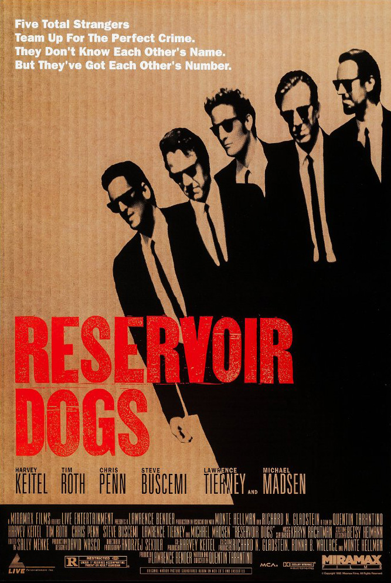

---
title: "Reservoir Dogs (1992)"
date: "2026-08-06T12:40:27+09:00"
tags:
    - movie
--- 
*Five total strangers 
Team up for the perfect crime 
They don't know each other's name 
But they've got each other's number*

Những kẻ lạ mặt được tập hợp lại bởi một ông trùm, mỗi người một cái tên là một màu sắc. Reservoir Dogs đã kể lại một phi vụ điển hình trên phim ảnh (tuyển người, lên kế hoạch, thực thi, xử lý hậu quả) nhưng với lối kể chuyện độc đáo mang tính chương hồi, câu chuyện lại diễn ra vô cùng kỳ thú.

Quả thực phi vụ "hoàn hảo" của Reservoir Dogs nếu được kể theo dòng thời gian, sẽ chả khác gì một câu chuyện phiếm ta kể nhau nghe ở quán trà đá. Câu chuyện được cắt thành nhiều phần, sắp xếp ở các vị trí khác nhau, đã đẩy sự kịch tính của bộ phim lên nhiều. Dù phim nhiều thoại nhưng lại khiến tôi không thể rời mắt.

Các phân đoạn quá khứ và các lời thoại giúp người xem hiểu hơn về nhân vật, tạo sự đồng cảm, nhưng lại càng bối rối trong việc tìm ra kẻ thù. Không chỉ vậy chúng còn gợi lên văn hoá đại chúng Mĩ thời đó với các Madonna hay các chương trình radio. 

Một bộ phim rất đáng xem và thưởng thức cái cách kể chuyện không giống ai của Quentin Taratino.

