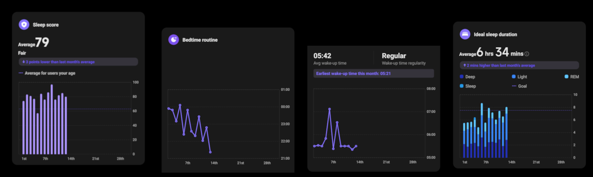

---
title: "Thử thách ngủ đủ"
date: "2026-07-13T18:05:50+09:00"
tags:
--- 
Tôi thường ngủ từ 10 giờ tối rồi dậy lúc 5 rưỡi sáng. Thoạt nghe thì rất là lành mạnh, nhưng sự thật tôi ngủ rất thiếu ổn định. Vài hôm chơi vài ván game, xem nốt vài video, tranh thủ làm bài, kết quả là giờ ngủ thay đổi liên tục.

Điều này có vẻ tệ hơn việc ngủ muộn đều (tôi đọc trên mạng thì bảo thế).

Nhìn lại tình trạng giấc ngủ hiện tại của tôi:

	- Đôi lúc buổi sáng tôi cảm thấy khá buồn ngủ, dù mình ngủ cũng không quá ít, kể cả sau khi uống cafe mọi thứ vẫn lờ đờ uể oải
	- Buổi tối tầm 8h, sau khi ăn xong là tôi đã khá uể oải rồi, khó mà làm những việc đòi hỏi tư duy
	- Những lần cố gắng cày việc, kết quả thì hoàn thành vội, tối thức khuya muộn xong hôm sau cả ngày uể oải, và nếu nhìn kỹ lại, hoá ra tôi còn ngủ nhiều hơn bình thường, nghĩa là nó còn tốn nhiều thời gian (chạy deadline) hơn.

Vì vậy tranh thủ khoảng thời gian xa nhà này, cũng hữu duyên xem được [video](https://www.youtube.com/watch?v=nFJokh0qfjU&t=858s) này. Tôi quyết định làm một thử thách để xem nếu bản thân "tuân thủ tuyệt đối" ưu tiên việc ngủ lên hàng đầu, liệu ***tôi có cảm thấy tốt hơn không***. 

Ngoại lệ duy nhất là bóng đá (hiện tại là World Cup 2026 và sắp tới là chỉ Manchester United <3)

Các quy tắc dưới đây sẽ được trình bày theo đúng trình tự thời gian.

1. Không cafe sau 12h trưa
2. Dừng màn hình từ 9h
3. Giãn cơ trước khi ngủ (5 phút)
4. Lên giường từ 9h45
5. Dậy lúc 5h30
6. Uống một cốc nước (ấm)
7. Thiền 10 phút
8. Morning Pages
9. Giãn cơ động tăng nhịp tim (5 phút)
10. Tắm
11. Không dùng điện thoại 1 tiếng sau khi dậy
12. Không cafe 90 phút sau khi dậy
13. Ngủ trưa trước 15h (10-15 phút)

Những thói quen trên khá đơn giản, không đắt đỏ, không cầu kỳ.

Theo thứ tự ưu tiên: Sleep > Eat > Workout, từ nay (13/07) đến hết tháng 7 tôi sẽ thử nghiệm thói quen này.

Link spreadsheet theo dõi ở đây nếu bạn muốn tham khảo: [Google Sheets](https://docs.google.com/spreadsheets/d/1F-Xtgi105P8qNpkaVMAwnhNNEP7qVscW0R6Fh1CI6mo/edit?usp=sharing)