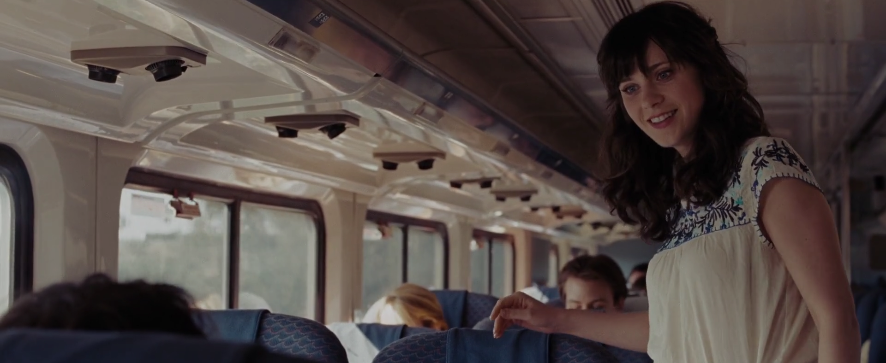
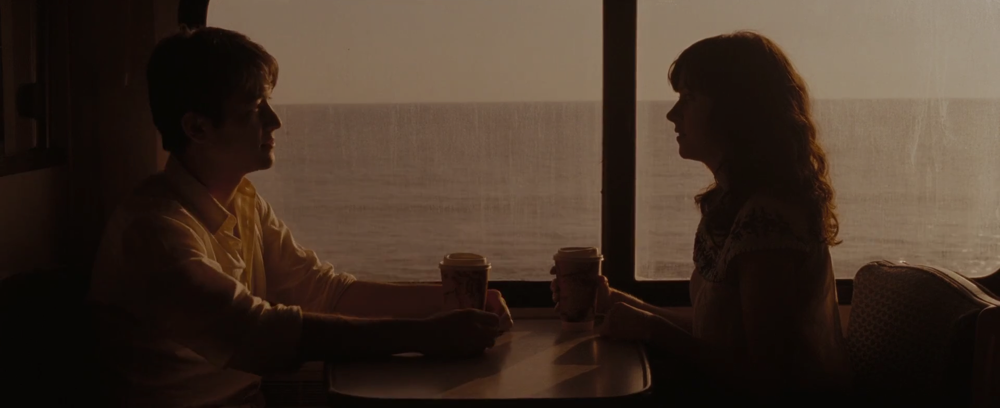
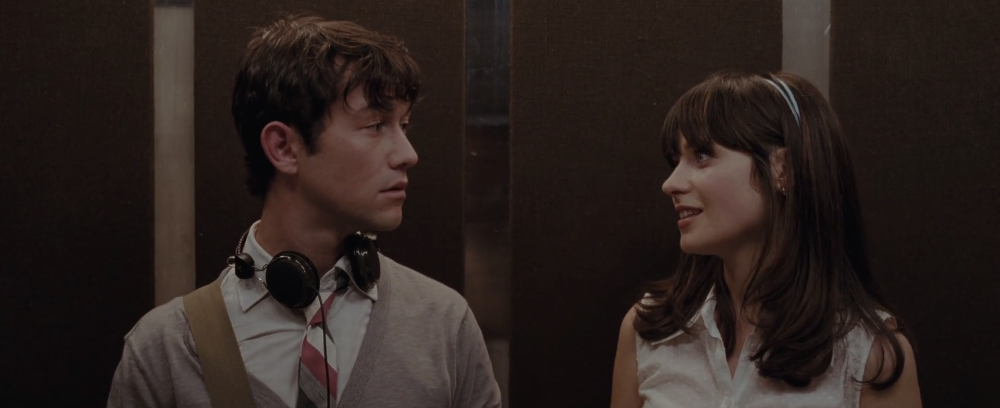
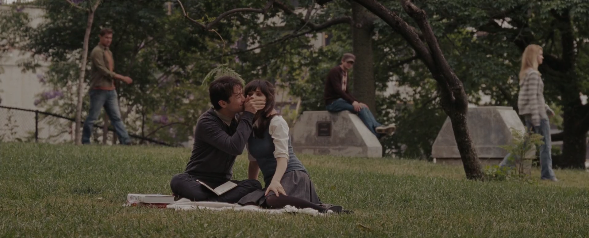
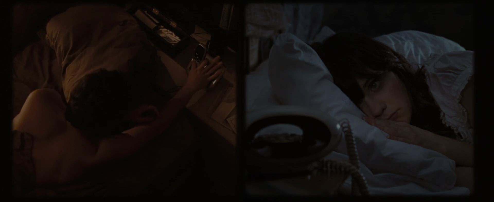
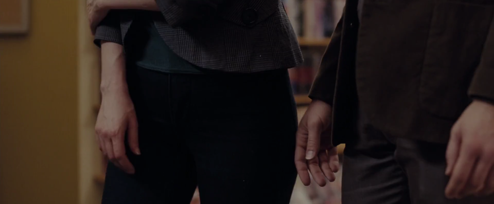
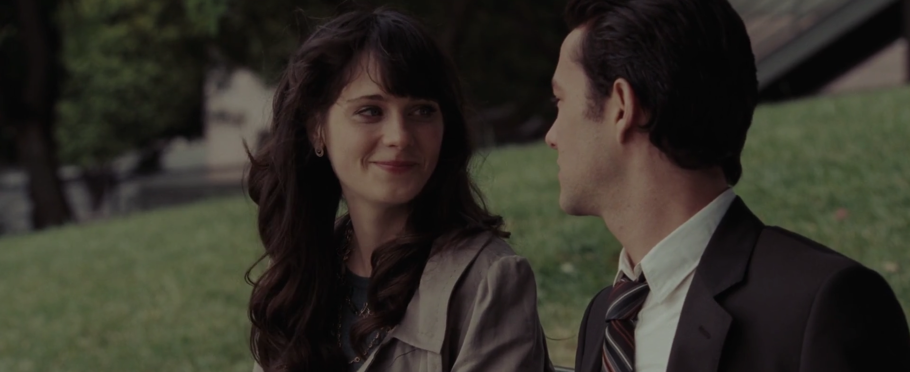

---
title: "Xin được mời người cốc cà phê"
date: "2026-05-30T17:06:06+07:00"
description: "Một bài viết bởi đá"
tags:
    - love
    - sad
--- 
*P/S: Một bài viết được viết bởi đá, do đá, và vì đá*

Thứ Ba ấy tôi gặp lại nàng ở phòng Pháp, lần đầu sau hai năm, tôi lấy hết dũng khí để ngỏ lời chào. Cứ nghĩ chỉ là một lần bản thân ngừng trốn chạy, rồi tôi mời nàng cà phê luôn.

Dù vẻ đã khác, nhưng người vẫn đẹp như cái ngày tôi mất em. Chúng tôi kể cho nhau những câu chuyện cuộc đời, những câu chuyện mà ta đã bỏ lỡ. Chúng tôi than thở những suy tư, như ném hết vào một cái hố đen không hẹn ngày gặp lại.

Trời cứ thế mà tối, cảm giác như những ngày xưa, cứ như hai năm vừa rồi chỉ là một giấc mơ.

Tôi gặp lại ánh mắt ấy, chính là cái ánh mắt và nụ cười ấy, đã khiến tôi rung động từ thuở nào. Một cảm giác khó tả, tôi nhớ như in cái dáng điệu đấy, cử chỉ không thể lẫn vào đâu được, và cả cái kiểu nói năng nũng nịu đầy trách cứ nhưng cũng nửa úp nửa mở ấy. Dù gì nó cũng đã chiếm trọn tâm trí tôi tận ba năm mà.

Thứ gì đó bừng lên trong tôi, một cảm xúc, một bàn tay muốn kéo người lại. Nhưng cũng lý trí cũng đã kéo tôi trở lại. "Nhớ lại những thứ đau buồn đi", nó nói. Trong đầu tôi tuôn trào cả những kỷ niệm vui vẻ lẫn những ký ức ảm đạm.

Tôi tiễn em về nhà. Trên đường về, cảm tưởng như lòng chứa chan biết bao điều muốn nói nhưng miệng lại không thể nói ra. Bao nhiêu trách móc, giận hờn đều tan thành một lời xin lỗi. Năm ấy, hai ta đều mang tội, dù cố đổ lỗi nhưng tôi biết đó là chỉ để tôi bớt tổn thương hơn thôi.

Chuyện tình ấy giúp ta trưởng thành hơn, đánh đổi lại là cơ hội để ở lại bên nhau. Có một chút tiếc nuối, môt chút đau lòng, nhưng tuyệt nhiên không một chút ân hận nào vì đã gặp được em. Có lẽ ở một vũ trụ khác, mọi chuyện có thể đã khác đi.

Những ngày sau đó, đầu óc tôi như trên mây, mơ tưởng ra những kịch bản mà Hollywood phải gọi bằng điện thoại. Lý trí vẫn cứ nhéo tai tôi lại, nhưng khi đã chìm đắm vào những mộng tưởng đó, tôi biết phải thoát ra như nào. Nhìn lại quá khứ, nhìn lại xem chúng ta đã từng tả tơi như nào trong chính câu chuyện của mình. Đó là cái tát mà tôi thực sự cần. Nhưng tại sao..

Quá khứ là thế, nhưng ai cũng có thể thay đổi mà. Thôi kệ đi, cứ sống đơn giản mà thuận theo tự nhiên vậy, để xem duyên số được trời sắp như nào. 

Còn nếu lần tới hữu duyên gặp lại, xin được mời người một cốc cà phê.